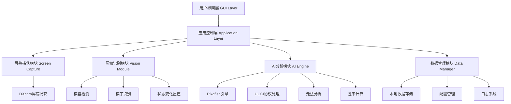

# 中国象棋智能对弈助手设计文档

## 概述

中国象棋智能对弈助手是一个基于计算机视觉和AI技术的桌面应用程序，旨在为象棋爱好者提供实时的棋局分析、走法建议和胜率评估。系统采用模块化架构，集成先进的图像识别技术和象棋AI引擎。

### 核心技术栈
- **编程语言**: Python 3.8+
- **计算机视觉**: OpenCV 4.8+, YOLOv8 (用于棋子检测)
- **屏幕捕获**: DXcam (Windows高性能捕获)
- **AI引擎**: Pikafish (基于Stockfish的象棋引擎)
- **GUI框架**: PyQt6
- **协议支持**: UCCI (Universal Chinese Chess Interface)
- **机器学习**: PyTorch (用于深度学习模型)

## 系统架构

### 整体架构图



### 分层架构设计

#### 1. 表示层 (Presentation Layer)
- **主界面**: 显示棋局状态、分析结果、操作控件
- **设置界面**: 系统配置、引擎参数调整
- **状态指示器**: 实时显示系统工作状态

#### 2. 业务逻辑层 (Business Logic Layer)
- **游戏状态管理**: 维护当前棋局状态
- **分析协调器**: 协调各模块工作
- **决策引擎**: 生成走法建议和分析报告

#### 3. 服务层 (Service Layer)
- **屏幕监控服务**: 实时捕获屏幕内容
- **图像处理服务**: 棋局识别和分析
- **AI引擎服务**: 与象棋引擎通信

#### 4. 数据访问层 (Data Access Layer)
- **配置存储**: 用户设置和系统参数
- **历史记录**: 对局历史和统计数据
- **缓存管理**: 提高系统响应速度

## 核心组件与接口

### 1. 屏幕捕获模块 (ScreenCaptureModule)

```python
class ScreenCaptureModule:
    """高性能屏幕捕获模块"""
    
    def __init__(self, target_fps: int = 30):
        self.dxcam = dxcam.create(output_idx=0, output_color="RGB")
        self.target_fps = target_fps
        self.capture_region = None
    
    def set_capture_region(self, x: int, y: int, width: int, height: int):
        """设置捕获区域"""
        pass
    
    def start_capture(self) -> None:
        """开始捕获"""
        pass
    
    def get_latest_frame(self) -> np.ndarray:
        """获取最新帧"""
        pass
    
    def stop_capture(self) -> None:
        """停止捕获"""
        pass
```

**设计决策**: 选择DXcam而非PyAutoGUI或MSS，因为其基于Desktop Duplication API，可实现240Hz+的高频率捕获，满足实时监控需求。

### 2. 棋局识别模块 (BoardRecognitionModule)

```python
class BoardRecognitionModule:
    """棋盘和棋子识别模块"""
    
    def __init__(self):
        self.board_detector = ChessBoardDetector()
        self.piece_classifier = ChessPieceClassifier()
        self.board_state = BoardState()
    
    def detect_board(self, image: np.ndarray) -> BoardRegion:
        """检测棋盘区域"""
        pass
    
    def recognize_pieces(self, board_image: np.ndarray) -> Dict[str, PieceInfo]:
        """识别所有棋子位置和类型"""
        pass
    
    def compare_states(self, previous: BoardState, current: BoardState) -> List[Move]:
        """比较棋局状态变化"""
        pass
```

**实现方案**:
- **棋盘检测**: 使用OpenCV的Canny边缘检测和Hough直线检测来识别棋盘网格
- **棋子分类**: 基于YOLOv8训练的深度学习模型，识别14种棋子类型（红黑各7种）
- **状态比较**: 通过哈希值快速比较棋局状态，识别走棋变化

### 3. AI引擎接口 (AIEngineInterface)

```python
class AIEngineInterface:
    """AI引擎接口"""
    
    def __init__(self, engine_path: str):
        self.engine = PikafishEngine(engine_path)
        self.ucci_handler = UCCIHandler()
        
    def set_position(self, fen: str) -> None:
        """设置棋局位置"""
        pass
    
    def get_best_moves(self, count: int = 3, depth: int = 20) -> List[MoveAnalysis]:
        """获取最佳走法分析"""
        pass
    
    def evaluate_position(self) -> PositionEvaluation:
        """评估当前局面"""
        pass
    
    def calculate_win_probability(self) -> float:
        """计算胜率"""
        pass
```

**引擎选择**: 使用Pikafish引擎，这是专为象棋优化的Stockfish分支，支持UCCI协议，具有强大的分析能力。

### 4. 数据模型 (Data Models)

#### 棋局状态模型
```python
@dataclass
class BoardState:
    """棋局状态"""
    fen: str  # FEN记录法
    pieces: Dict[str, Piece]  # 棋子位置映射
    current_player: str  # 当前走棋方
    move_count: int  # 回合数
    timestamp: datetime
    
@dataclass 
class Piece:
    """棋子信息"""
    type: str  # 棋子类型 (K, A, B, N, R, C, P)
    color: str  # 颜色 (red, black)
    position: Tuple[int, int]  # 位置坐标
    confidence: float  # 识别置信度

@dataclass
class Move:
    """走法信息"""
    from_pos: Tuple[int, int]
    to_pos: Tuple[int, int]
    piece: Piece
    captured: Optional[Piece] = None
    notation: str = ""  # 中文记谱法
```

#### 分析结果模型
```python
@dataclass
class MoveAnalysis:
    """走法分析"""
    move: Move
    evaluation: float  # 评估分数
    depth: int  # 分析深度
    win_probability: float  # 胜率
    explanation: str  # 中文解释
    tactical_tags: List[str]  # 战术标签

@dataclass
class PositionEvaluation:
    """局面评估"""
    material_balance: float  # 子力平衡
    positional_score: float  # 位置评分
    safety_score: float  # 安全性评分
    win_probability: float  # 胜率
    phase: str  # 对局阶段 (opening, middle, endgame)
```

### 5. 用户界面组件 (UI Components)

#### 主界面设计
```python
class MainWindow(QMainWindow):
    """主窗口"""
    
    def __init__(self):
        super().__init__()
        self.setup_ui()
        self.setup_connections()
    
    def setup_ui(self):
        # 棋盘显示区域
        self.board_widget = BoardDisplayWidget()
        
        # 分析面板
        self.analysis_panel = AnalysisPanel()
        
        # 控制面板
        self.control_panel = ControlPanel()
        
        # 状态栏
        self.status_bar = StatusBar()

class BoardDisplayWidget(QWidget):
    """棋盘显示组件"""
    
    def paintEvent(self, event):
        """绘制棋盘和分析标记"""
        pass
    
    def highlight_suggested_moves(self, moves: List[Move]):
        """高亮显示建议走法"""
        pass

class AnalysisPanel(QWidget):
    """分析面板"""
    
    def update_evaluation(self, eval: PositionEvaluation):
        """更新局面评估"""
        pass
    
    def update_move_suggestions(self, moves: List[MoveAnalysis]):
        """更新走法建议"""
        pass
```

## 错误处理策略

### 1. 识别错误处理
- **低置信度检测**: 当棋子识别置信度低于90%时，标记为不确定状态
- **状态不一致**: 检测到不合法的棋局状态时，回退到上一个确认状态
- **遮挡处理**: 部分棋子被遮挡时，使用上下文信息推断

### 2. 引擎通信错误
- **连接超时**: 实现自动重连机制，最多重试3次
- **协议错误**: 解析UCCI协议失败时记录日志并降级服务
- **计算超时**: 设置计算时间限制，超时返回当前最佳结果

### 3. 系统资源错误
- **内存不足**: 实现LRU缓存清理机制
- **CPU过载**: 动态调整分析深度和捕获频率
- **磁盘空间**: 定期清理过期日志和缓存文件

```python
class ErrorHandler:
    """统一错误处理"""
    
    def __init__(self):
        self.logger = logging.getLogger(__name__)
        self.error_count = defaultdict(int)
    
    def handle_vision_error(self, error: VisionError) -> VisionResult:
        """处理视觉识别错误"""
        if error.type == "LOW_CONFIDENCE":
            return self.request_manual_confirmation()
        elif error.type == "INVALID_STATE":
            return self.rollback_to_previous_state()
    
    def handle_engine_error(self, error: EngineError) -> None:
        """处理引擎错误"""
        if error.type == "CONNECTION_TIMEOUT":
            self.attempt_reconnection()
        elif error.type == "COMPUTATION_TIMEOUT":
            self.reduce_analysis_depth()
```

## 测试策略

### 1. 单元测试
- **视觉识别模块**: 使用标准棋局图片测试识别准确率
- **AI接口模块**: Mock引擎响应测试协议解析
- **数据模型**: 测试FEN转换和状态比较逻辑

### 2. 集成测试
- **端到端流程**: 从屏幕捕获到分析结果的完整流程测试
- **性能测试**: 在不同系统配置下的响应时间测试
- **稳定性测试**: 长时间运行的内存泄漏和崩溃测试

### 3. 用户验收测试
- **准确性测试**: 与象棋专家合作验证分析准确性
- **易用性测试**: 用户界面和交互体验测试
- **兼容性测试**: 不同象棋软件和屏幕分辨率的兼容性

```python
# 测试配置
TEST_CONFIG = {
    "vision_accuracy_threshold": 0.95,
    "response_time_limit": 3.0,  # 秒
    "memory_limit": 500 * 1024 * 1024,  # 500MB
    "cpu_usage_limit": 20.0,  # 20%
}

class TestSuite:
    """测试套件"""
    
    def test_board_recognition_accuracy(self):
        """测试棋盘识别准确率"""
        pass
    
    def test_real_time_performance(self):
        """测试实时性能"""
        pass
    
    def test_engine_integration(self):
        """测试引擎集成"""
        pass
```

## 性能优化策略

### 1. 计算优化
- **多线程处理**: 屏幕捕获、图像处理、AI分析并行执行
- **缓存机制**: 缓存已分析的棋局状态和评估结果
- **懒加载**: 按需加载深度学习模型和引擎

### 2. 内存管理
- **对象池**: 重用图像缓冲区和数据结构
- **垃圾回收**: 主动释放大型对象内存
- **内存映射**: 对大型模型文件使用内存映射

### 3. 网络和I/O优化
- **异步I/O**: 文件读写和网络通信使用异步模式
- **批处理**: 批量处理多个分析请求
- **压缩存储**: 对历史数据使用压缩存储

```python
class PerformanceManager:
    """性能管理器"""
    
    def __init__(self):
        self.thread_pool = ThreadPoolExecutor(max_workers=4)
        self.cache = LRUCache(maxsize=1000)
        self.profiler = cProfile.Profile()
    
    def optimize_capture_rate(self):
        """动态调整捕获频率"""
        cpu_usage = psutil.cpu_percent()
        if cpu_usage > 80:
            self.reduce_capture_rate()
        elif cpu_usage < 40:
            self.increase_capture_rate()
    
    def cleanup_memory(self):
        """清理内存"""
        gc.collect()
        self.cache.clear_expired()
```

## 部署和配置

### 1. 系统要求
- **操作系统**: Windows 10/11 (64位)
- **处理器**: Intel i5-8400 或 AMD Ryzen 5 2600 及以上
- **内存**: 8GB RAM (推荐16GB)
- **显卡**: 支持DirectX 11的独立显卡 (可选，用于加速)
- **存储**: 2GB可用空间

### 2. 配置文件结构
```yaml
# config.yaml
application:
  capture_fps: 30
  analysis_depth: 20
  ui_language: "zh_CN"
  
vision:
  confidence_threshold: 0.9
  model_path: "models/yolov8_xiangqi.pt"
  calibration_enabled: true
  
engine:
  path: "engines/pikafish.exe"
  threads: 4
  hash_size: 256  # MB
  
logging:
  level: "INFO"
  file: "logs/xiangqi_assistant.log"
  max_size: "10MB"
  backup_count: 5
```

### 3. 安装脚本
```python
class Installer:
    """安装程序"""
    
    def check_system_requirements(self):
        """检查系统要求"""
        pass
    
    def download_models(self):
        """下载AI模型文件"""
        pass
    
    def configure_engines(self):
        """配置象棋引擎"""
        pass
    
    def create_shortcuts(self):
        """创建桌面快捷方式"""
        pass
```

## 安全考虑

### 1. 数据隐私
- **本地处理**: 所有屏幕数据在本地处理，不上传至外部服务器
- **数据加密**: 敏感配置信息使用AES加密存储
- **访问控制**: 限制对用户文件和系统资源的访问

### 2. 应用安全
- **输入验证**: 对所有用户输入进行严格验证
- **权限最小化**: 应用仅请求必要的系统权限
- **代码签名**: 发布版本使用数字签名验证

```python
class SecurityManager:
    """安全管理器"""
    
    def __init__(self):
        self.encryptor = Fernet(self.load_key())
    
    def encrypt_config(self, data: dict) -> bytes:
        """加密配置数据"""
        pass
    
    def validate_input(self, input_data: str) -> bool:
        """验证用户输入"""
        pass
    
    def check_permissions(self) -> bool:
        """检查应用权限"""
        pass
```

这个设计文档为中国象棋智能对弈助手提供了完整的技术架构和实现方案。设计充分考虑了性能、可用性、可维护性和安全性，采用了现代化的技术栈和最佳实践。